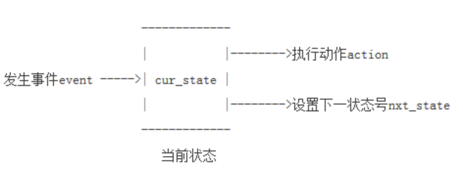
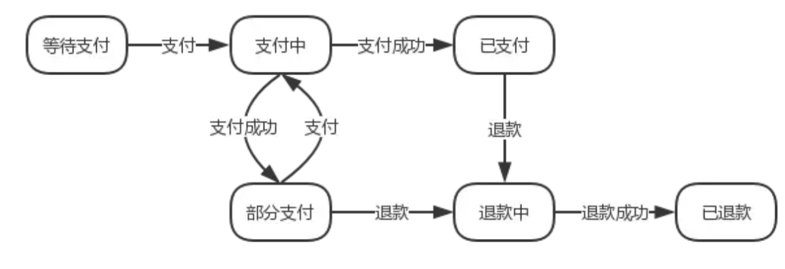
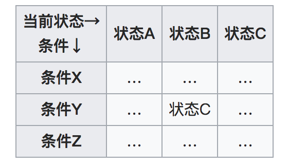

### 有限状态机介绍

> **有限状态机**（英语：finite-state machine，[缩写](https://zh.wikipedia.org/wiki/%E7%B8%AE%E5%AF%AB)：**FSM**）又称**有限状态自动机**，简称**状态机**，是表示有限个[状态](https://zh.wikipedia.org/wiki/%E7%8A%B6%E6%80%81)以及在这些状态之间的转移和动作等行为的[数学模型](https://zh.wikipedia.org/wiki/%E6%95%B0%E5%AD%A6%E6%A8%A1%E5%9E%8B)。以上是维基百科的介绍。

软件上常用的一种处理方法它把复杂的控制逻辑分解成有限个稳定状态，在每个状态上判断事件，变连续处理为离散数字处理，符合计算机的工作特点。同时，因为有限状态机具有有限个状态，所以可以在实际的工程上实现。但这并不意味着其只能进行有限次的处理，相反，有限状态机是闭环系统，有限无穷，可以用有限的状态，处理无穷的事务。

**一句话介绍**：将有限个不变的状态以及在这些状态之间的转移和动作行为，以事件驱动迁移目标状态变换的一个模型

#### 一、流图

> 如下图所示，发生事件(event)后，根据当前状态(cur_state)，决定执行的动作(action)，并转移为下一个状态号(nxt_state)



#### 二、一些概念

1. **状态（State）**指的是对象在其生命周期中的一种状况，处于某个特定状态中的对象必然会满足某些条件、执行某些动作或者是等待某些事件。
2. **事件（Event）**指的是在时间和空间上占有一定位置，并且对状态机来讲是有意义的那些事情。事件通常会引起状态的变迁，促使状态机从一种状态切换到另一种状态。
3. **转换（Transition）**指的是两个状态之间的一种关系，表明对象将在第一个状态中执行一定的动作，并将在某个事件发生同时某个特定条件满足时进入第二个状态。
4. **动作（Action）**指的是状态机中可以执行的那些原子操作，所谓原子操作指的是它们在运行的过程中不能被其他消息所中断，必须一直执行下去。

#### 三、三个特征

* 状态（state）总数是有限的
* 任一时刻，只处在一种状态之中
* 某种条件下，会从一种状态转变（transition）到另一种状态

#### 四、分类

* **Moore machine**

  Moore状态机只使用entry action，输出只依赖状态，不依赖输入

  

* **Mealy machine** 米利

  Mealy状态机使用input、action，输出依赖输入input和状态state。使用这种状态机通常可以减少状态的数量

  

#### 五、实现方式

* switch/case或者if/else

  这无意是最直观的方式，使用一堆条件判断，会编程的人都可以做到，对简单小巧的状态机来说最合适，但是毫无疑问，这样的方式比较原始，对庞大的状态机难以维护。

  我们就以支付为例，一笔订单可能有 `等待支付`、`支付中`、`已支付` 等状态。对于 `等待支付` 的订单，用户可能通过第三方支付如微信支付或支付宝进行付款，支付完成后第三方支付会回调通知支付结果。我们可能会这样来处理：

  ~~~java
  // 支付中
  public void pay(Order order) {    
      if (order.status == UNPAID) {
         order.status = PAYING;
         // 处理支付
      } else {
          throw IllegalStateException("不能支付");
      }
  }    
  // 支付成功回调
  public void paySuccess(Order order) {
      if (order.status == PAYING) {
         // 处理支付成功通知
         order.status = PAID;
      } else throw IllegalStateException("不能支付"); 
  }
  ~~~

  这样看起来好像没什么问题。但是假设我们允许用户多次支付完成一笔订单，于是我们需要增加一个 `部分支付` 状态。订单在  `部分支付`状态时，可以进行下一步的支付；订单收到支付成功通知时，根据支付金额，可能会转换到  `已支付` 或 `部分支付`  状态。现在，我们不得不在 `pay` 和  `paySuccess` 里处理这个状态：

  

  ~~~java
  public void pay(Order order) {    
      if (order.status == UNPAID || order.status == PARTIAL_PAID) {
          order.status = PAYING;
          // 处理支付
      } else {
          throw IllegalStateException("不能支付");
      }
  }    
  public void paySuccess(Order order) {
      if (order.status == PAYING) {
          // 处理支付成功通知
          if (order.paidFee == order.totalFee) {
              order.status = PAID;
          } else {
              order.status = PARTIAL_PAID;
          }
      } else {
          throw IllegalStateException("不能支付");
      }
  }
  ~~~

  对于状态不多、转换也不是很复杂的情况，用状态判断来处理还也算简洁明了。但一旦状态变多，操作变复杂，那么业务代码就会充斥各种条件判断，各种状态处理逻辑散落在各处。这个时候调整一些处理逻辑，就会比较麻烦，还很容易出错。

* 状态表

  维护一个二维状态表，横坐标表示当前状态，纵坐标表示输入，表中一个元素存储下一个状态和对应的操作。这一招易于维护，但是运行时间和存储空间的代价较大。

  

  * 使用State Pattern 

  使用State Pattern使得代码的维护比switch/case方式稍好，性能上也不会有很多的影响，但是也不是100％完美。不过Robert C. Martin做了两个自动产生FSM代码的工具，for java和for C++各一个，在http://www.objectmentor.com/resources/index上有免费下载，这个工具的输入是纯文本的状态机描述，自动产生符合State Pattern的代码，这样developer的工作只需要维护状态机的文本描述，每必要冒引入bug的风险去维护code。

  

  - 状态模式

  在状态模式中，我们将对象在不同状态下的行为封装到不同的具体状态类中，为了让系统具有更好的灵活性和可扩展性，同时对各状态下的共有行为进行封装，我们需要对状态进行抽象，引入了抽象状态类角色，如下图所示

  

  

  ```java
  public abstract class State {  
      //声明抽象业务方法，不同的具体状态类可以不同的实现  
      public abstract void handle();  
  }
  public class ConcreteStateA extends State {  
      public void handle() {  
          //方法具体实现代码  
      }  
  } 
  public class ConcreteStateB extends State {  
      public void handle() {  
          //方法具体实现代码  
      }  
  } 
  public class Context {  
      private State state; //维持一个对抽象状态对象的引用  
      private int value; //其他属性值，该属性值的变化可能会导致对象状态发生变化  
   
      //设置状态对象  
      public void setState(State state) {  
          this.state = state;  
      }  
   
      public void request() {  
          //其他代码  
          state.handle(); //调用状态对象的业务方法  
          //其他代码  
      }  
  } 
  // test
  public static void main(String[] args) {
      Context content = new Content();
      content.setState(new ConcreteStateA());
      content.request();
      content.setState(new ConcreteStateB());
      content.request();
  }
  ```
  继续上例：

  ~~~java
  abstract class OrderState {    
      public abstract OrderState pay(Order order);
      public abstract OrderState paySuccess(Order order);
      public abstract OrderState refund(Order order);
      public abstract OrderState refundSuccess(Order order);
  }
  
  public class PayingOrderState implement OrderState { 
      // 
      public OrderState pay(Order order) {
          throw IllegalStateException("已经在支付中"); 
      }
      public OrderState paySuccess(Order order, long fee) {
          // 处理支付成逻辑
          ... ...
          if (order.paidFee < order.totalFee) {
             order.setState(new PartialPaidOrderState());             
          } else {
             order.setState(new PaidOrderState());
          }
      }
      // 此状态不支持操作
      public OrderState refund(Order order) {
          throw IllegalStateException("尚未完成支付"); 
      }
      public OrderState refundSuccess(Order order) {
          throw IllegalStateException("尚未完成支付"); 
      }
  }
  
  public class UnpaidOrder implement OrderState { ... }
  public class PartialPaidOrderState implement OrderState { ... }
  public class PaidOrderState implement OrderState { ... }
  
  // Context
  public class Order {    
      // 假设
      OrderState state = new PaidOrderState();
      public void pay(long fee) {
          state.pay(fee);
      }
      public void paySuccess(long fee) {
          state.paySuccess(this, fee);        
      }
  }
  ~~~

  

* 枚举策略模式

  

  ```java
  public enum  StrategyEnum {
      ADD {
          @Override
          public int calculate(int a, int b) {
              return a + b;
          }
      },
  
      SUBTRACT {
          @Override
          public int calculate(int a, int b) {
              return a - b;
          }
      };
  
      // 
      public abstract int calculate(int a, int b);
  
      public static void main(String[] args) {
          // 3
          int addResult = StrategyEnum.ADD.calculate(1, 2);
          System.out.println(addResult);
  
          // -1
          int subResult = StrategyEnum.SUBTRACT.calculate(1, 2);
          System.out.println(subResult);
  
      }
  }
  ```

#### 参考链接

* [有限状态机FSM](http://xfhnever.com/2014/07/19/state-machine/)
* [状态机与状态模式](http://yukai.space/2017/08/10/%E7%8A%B6%E6%80%81%E6%9C%BA%E4%B8%8E%E7%8A%B6%E6%80%81%E6%A8%A1%E5%BC%8F/)
* [JAVA设计模式（18）：行为型-状态模式（State）](https://blog.csdn.net/lovesomnus/article/details/45750039)
* [复杂业务状态的处理：从状态模式到 FSM](https://juejin.im/entry/5a26b17df265da4319562263)

