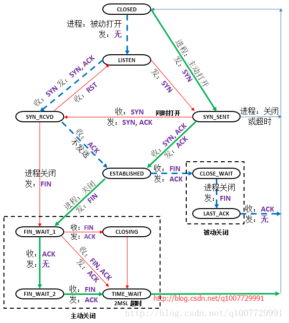
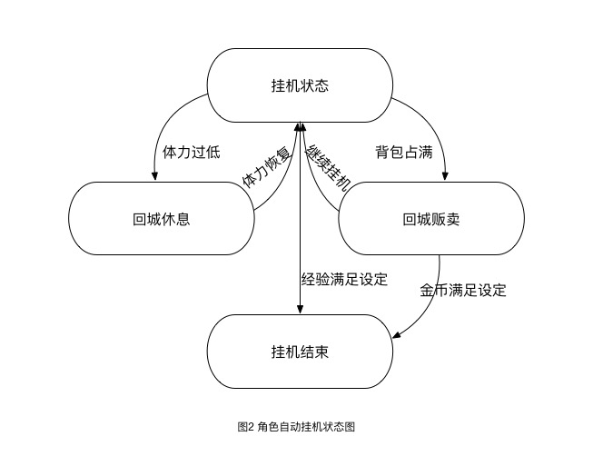

### 状态机用途

> 使用场景：应用程序的状态数量是固定的，并且事件会按照顺序依次在不同状态之间转换

#### 正则表达式 

* 作为一个简单的例子，下面这个状态机就可以识别正则表达式a(bb)+a所代表的字符串集合。

  

#### 网络协议 

* TCP协议

  

#### 游戏设计 

#### 服务端

电商场景（订单、物流、售后）、社交（IM消息投递）、分布式集群管理（分布式计算平台任务编排）等场景都有大规模的使用